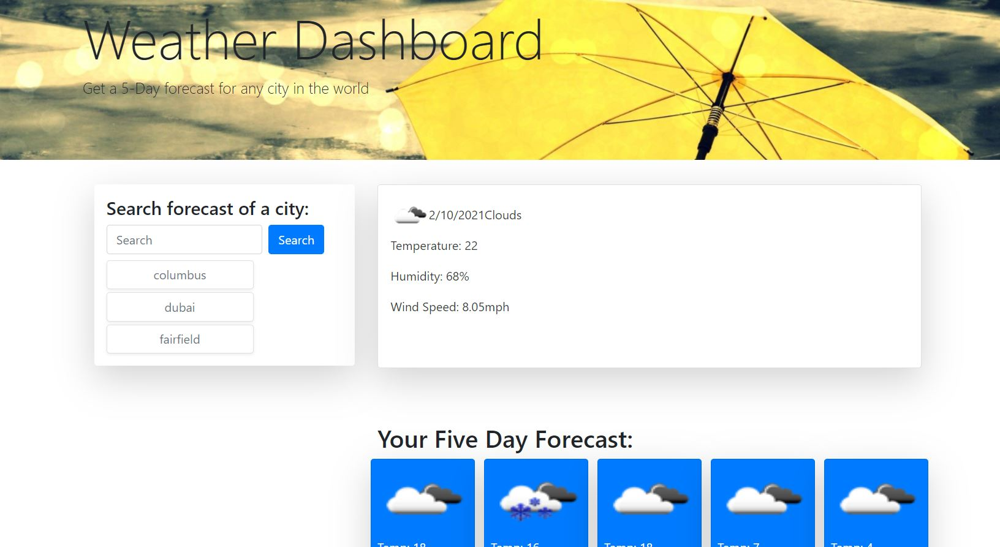

# Weather-Dashboard

<a href="https://pennyquirino.github.io/Weather-Dashboard/">Click to see my work</a> 

## User Story
AS A traveler
I WANT to see the weather outlook for multiple cities
SO THAT I can plan a trip accordingly

## Acceptance Criteria
GIVEN a weather dashboard with form inputs
WHEN I search for a city
THEN I am presented with current and future conditions for that city and that city is added to the search history
WHEN I view current weather conditions for that city
THEN I am presented with the city name, the date, an icon representation of weather conditions, the temperature, the humidity, the wind speed, and the UV index
WHEN I view the UV index
THEN I am presented with a color that indicates whether the conditions are favorable, moderate, or severe
WHEN I view future weather conditions for that city
THEN I am presented with a 5-day forecast that displays the date, an icon representation of weather conditions, the temperature, and the humidity
WHEN I click on a city in the search history
THEN I am again presented with current and future conditions for that city
WHEN I open the weather dashboard
THEN I am presented with the last searched city forecast

I had to completely redo this homework. I lost track of how many times I did it. In the end, I got the majority to work however the history buttons when clicked, will not generate the weather. The search area does generate the weather so I know it is a functionality with the button code. This is something I will improve on in the days to come but wanted to get something submitted. 

